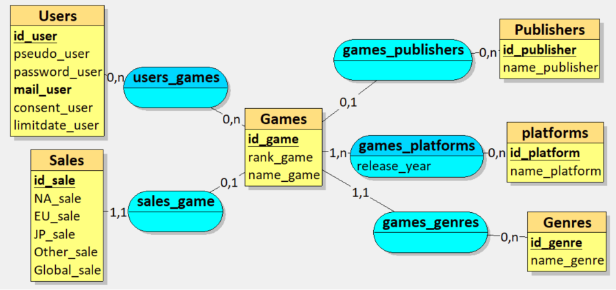
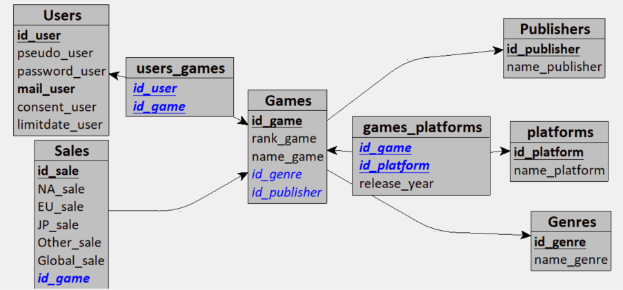

# 🎮 Gestion de base de données Jeux Vidéo (vgsales) + CRUD Python/SQLAlchemy

## 1. 🧠 Conception de la base de données

Ce projet part du fichier CSV `vgsales` pour concevoir et implémenter une base de données relationnelle autour des ventes de jeux vidéo, des plateformes, des genres, des éditeurs et des utilisateurs.

### 1.1. 📐 MCD (Modèle Conceptuel de Données)

Le MCD a été réalisé en premier pour identifier les entités, leurs attributs et les relations entre elles (Jeux, Genres, Publishers, Platforms, Users, Sales, etc.).

### 1.2. 🧱 MLD (Modèle Logique de Données)

À partir du MCD, un MLD a été construit pour obtenir les tables, les clés primaires, les clés étrangères et les tables d’association (ex : `users_games`, `games_platforms`, etc.).

Ces modèles ont ensuite servi de base pour la création des classes SQLAlchemy et de la structure finale de la base de données.

---

## 2. 🛠️ Implémentation avec SQLAlchemy

### 2.1. 🧩 Modèles (ORM)

Pour chaque table du MLD, une classe Python SQLAlchemy a été créée :

- `User`
- `Game`
- `Sale`
- `Publisher`
- `Platform`
- `Genre`
- `User_Game` (table d’association Users/Games)
- `Game_Platform` (table d’association Games/Platforms)

Chaque classe :
- Hérite de `Base` (SQLAlchemy).
- Déclare sa table via `__tablename__`.
- Déclare ses colonnes (`Column`, `Integer`, `String`, `Boolean`, `ForeignKey`, etc.).
- Gère les relations via `relationship` (ex : `Game.sales`, `Game.genre`, `User.games_links`, etc.).

### 2.2. 🗄️ Création physique de la base

Un script `init_db.py` initialise la base de données SQLite :

- Import de `Base` et `engine` depuis `database.py`.
- Appel à `Base.metadata.create_all(bind=engine)` pour créer toutes les tables.
- La base est générée à partir des classes modèles, en cohérence avec le MLD.

---

## 3. 🎭 Génération de données de test avec Faker

Pour peupler la table `Users`, un script utilise `Faker` :

- Génération de faux utilisateurs multi-langues (locales variées).
- Hashage des mots de passe avec `bcrypt` (`hash_password`).
- Hashage des emails avec `SHA256` (`hash_email`) pour respecter la confidentialité.
- Création de liens aléatoires entre `User` et `Game` via la table d’association `User_Game`.

Objectifs :
- Tester la base avec des données réalistes.
- Travailler dans un contexte proche d’un cas réel (consentement, date de limite d’utilisation, etc.).

---

## 4. ⚙️ CRUD spécialisés par classe (version initiale)

Dans un premier temps, des CRUD **spécifiques** ont été créés pour certaines classes, par exemple :

- `game_services.py` pour `Game`
- Possibilité de créer, lire, mettre à jour et supprimer des jeux avec :
  - Saisie guidée.
  - Affichage des genres/publishers disponibles.
  - Recherche par ID ou par nom (via `ilike`).
  - Gestion fine des erreurs (`try/except SQLAlchemyError`).

Avantages :
- Logique claire.
- Saisie adaptée à chaque table.
- Affichage plus riche (ex : nom du genre, nom du publisher, etc.).

Inconvénient :
- Très répétitif (beaucoup de code dupliqué).
- Long et fastidieux à maintenir lorsqu’on ajoute de nouvelles tables.

---

## 5. 🔄 Mise en place d’un CRUD générique dynamique

Pour éviter de réécrire un CRUD par classe, un **CRUD générique** a été développé dans `crud_generic.py` :

### 5.1. 🎯 Objectifs du CRUD générique

- S’adapter à n’importe quelle classe SQLAlchemy (`User`, `Game`, `Sale`, etc.).
- Générer automatiquement les prompts de saisie à partir des colonnes du modèle.
- Gérer :
  - Les types (`int`, `str`, `bool`, email).
  - Les contraintes métiers (`min_len`, `max_len` via `get_field_constraints`).
  - Les clés étrangères (affichage des options, saisie de l’ID lié).
  - Le hashage spécifique pour `User` :
    - `password_user` via `bcrypt`
    - `mail_user` via `SHA256`

### 5.2. 🧾 Fonctions principales

- `hash_password(password)` : hash du mot de passe.
- `hash_email(email)` : hash de l’email (minuscule + trim + SHA256).
- `is_valid_email(email)` : validation d’email via regex.
- `get_safe_input(...)` : fonction générique de saisie sécurisée (types, min/max, choix).
- `get_field_constraints(field_name)` : dictionnaire des contraintes par champ.
- `get_foreign_key_options(session, model, fk_field)` : récupération des options pour une clé étrangère.
- `display_options(options, display_field)` : affichage lisible des options (ID + nom).
- `input_generic_data(session, model_class, exclude_fields=None)` :
  - Parcourt les colonnes du modèle.
  - Génère dynamiquement les invites de saisie.
  - Applique les contraintes.
  - Gère les cas particuliers (User, booléens, FK).
- `create_generic(model_class, model_name)` :
  - Saisie d’un nouvel enregistrement.
  - Insertion en base.
- `read_generic(model_class, model_name)` :
  - Lecture de tous les enregistrements ou par ID.
  - Affichage simplifié, respectant le RGPD pour les `User`.
- `update_generic(model_class, model_name)` :
  - Chargement de l’instance par ID.
  - Saisie des nouveaux champs.
  - Mise à jour uniquement si changement.
- `delete_generic(model_class, model_name)` :
  - Suppression par ID avec confirmation.

### 5.3. ⚖️ Limites actuelles du CRUD générique

Même s’il fonctionne, plusieurs points restent à optimiser :

- Affichage des résultats basé en grande partie sur `str(instance)` ou seulement ID + un attribut (name/pseudo).
- Peu de possibilités de recherche avancée (par nom, filtre partiel, etc.).
- Saisie encore très centrée sur les IDs pour les FK (pas encore de recherche par nom de genre ou nom de publisher).
- Comportement générique moins ergonomique que les CRUD spécialisés.

---

## 6. 🖥️ Module `view` et menu global

Un module `view/view.py` gère l’interface en ligne de commande :

- `MODELS` : liste de toutes les classes (User, Game, Sale, etc.).
- `MODEL_NAMES` : mapping classe → nom lisible.
- `display_models()` : affiche les tables disponibles.
- `get_model_choice()` : permet à l’utilisateur de choisir une table.
- `display_crud_menu(model_name)` : affiche le sous-menu CRUD pour une table.
- `run_crud_interface(model_class)` : exécute le CRUD générique (create/read/update/delete) pour la table choisie.
- `run_app()` : boucle principale de l’application.

Usage typique :

1. Lancer `main.py`.
2. Choisir une table (User, Game, Sale, etc.).
3. Choisir une opération : créer, lire, modifier, supprimer.
4. Saisir les données selon les invites proposées.

---

## 7. 🧩 Coexistence entre CRUD générique et CRUD spécialisés (relique de la première approche)

Le CRUD générique fonctionne pour toutes les tables, mais :

- Les CRUD spécialisés par classe restent plus complets et plus ergonomiques pour certaines opérations métiers (recherche par nom, affichage enrichi, filtres plus fins).
- Le projet conserve volontairement ces deux approches meme si seulement le generique est foncionnel actuellement:
  - CRUD spécialisés : pour des besoins précis, avec logique métier avancée plus facile à implémenter.
  - CRUD générique : pour factoriser le code et couvrir rapidement toutes les tables.

---

## 8. 🚀 Pistes d’amélioration

Plusieurs améliorations possibles sont déjà identifiées :

- Améliorer l’affichage du CRUD générique :
  - Afficher plusieurs colonnes (ID, nom, FK résolues, etc.).
  - Offrir des modes de recherche par nom, par partie de chaîne, par combinaison d’attributs.
- Ajouter des filtres spécifiques par modèle (ex : recherche de jeux par genre, par publisher, par plateforme).
- Intégrer des contrôles métiers plus poussés (cohérence des dates, valeurs numériques, etc.).
- Factoriser certains comportements pour conserver la lisibilité du code malgré la dynamique.

---

## 9. 🧾 Résumé

Ce projet illustre un cycle complet :

1. Conception MCD / MLD à partir du CSV `vgsales`.
2. Modélisation ORM avec SQLAlchemy (classes par table).
3. Génération de la base SQLite.
4. Génération de données de test avec Faker pour la table `Users`.
5. Création de CRUD spécialisés par classe.
6. Développement d’un CRUD générique dynamique pour toutes les tables.
7. Mise en place d’une interface console (module `view`) pour piloter l’ensemble.

L’ensemble montre à la fois la rigueur de la conception de base de données et les compromis pratiques nécessaires lorsqu’on cherche à généraliser un CRUD pour plusieurs modèles tout en gardant une bonne ergonomie.
